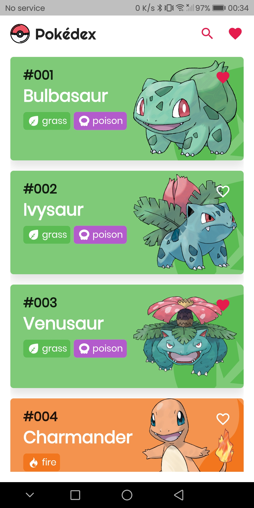
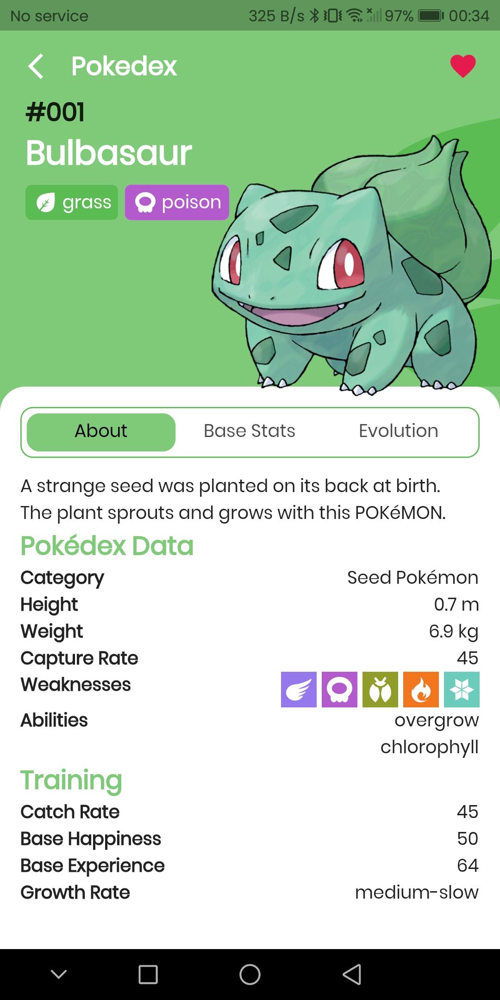
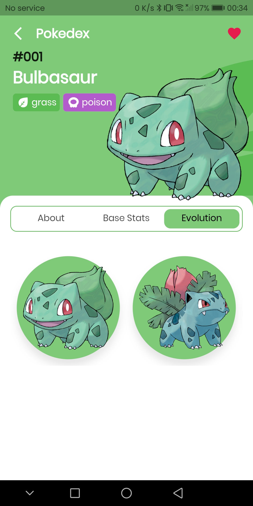
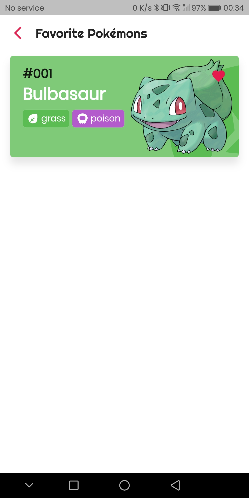
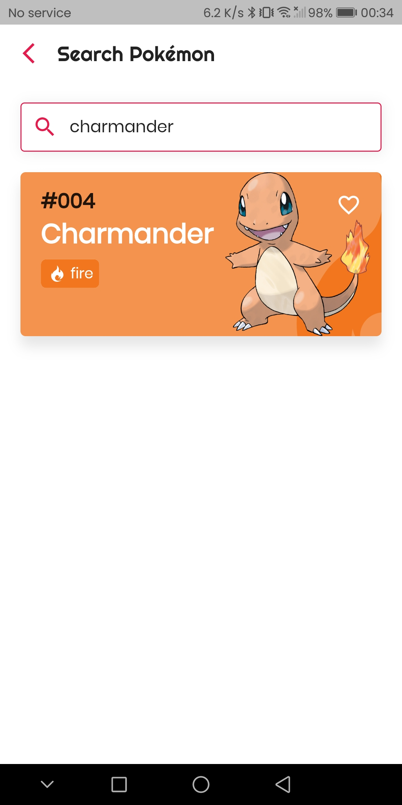
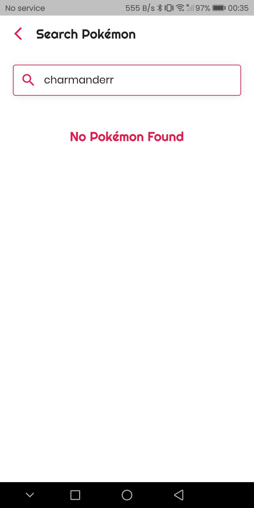

    

<h1 align="center">
    Pokedex flutter
</h1>

# App Preview

<!-- <table>
  <tr>
    <td><td>
  </tr>
</table> -->
<table>
  <tr>
    <th>Home Screen</th>
    <th>Detail Screen</th>
    <th>Detail Screen</th>
  </tr>
  <tr>
    <td></td>
    <td></td>
    <td></td>
  </tr>
  <tr>
    <th>Favorite Screen</th>
    <th>Search Screen</th>
    <th>Search Screen</th>
  </tr>
  <tr>
    <td></td>
    <td></td>
    <td></td>
  </tr>
  
</table>

 

# Features

- Infinite scrolling
- Add to favorite
- Search Pokemon by name/id
- Caching with hive-db
- State management with getx
- Dio for api calls
- Frezzed for code generation

# Contributing

The purpose of this project was to learn flutter. I hope you can help me improve it.

I'm always welcome to any contribution! Feel free to report Issue or send Pull Requests!

# About me

